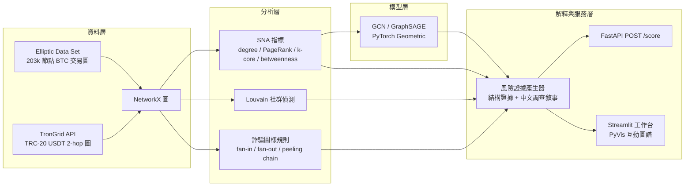
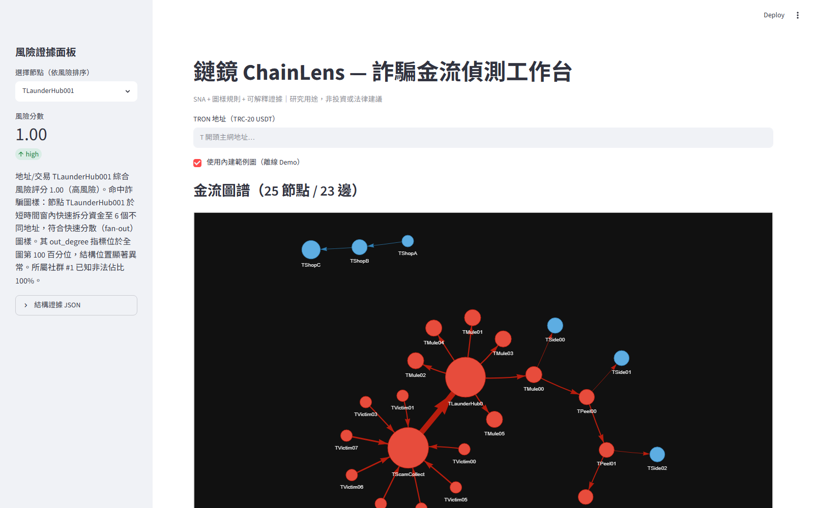
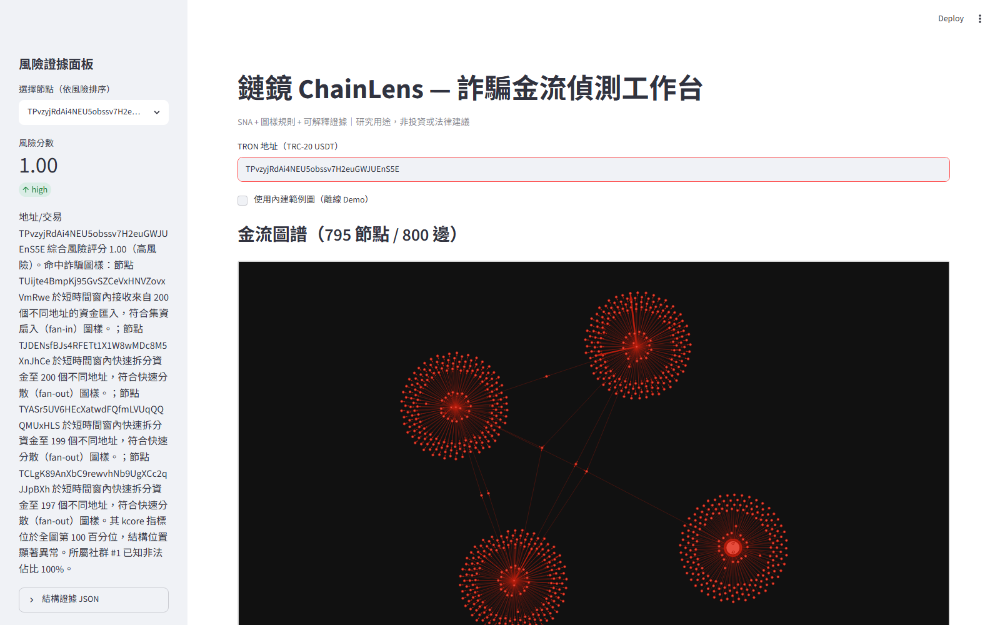
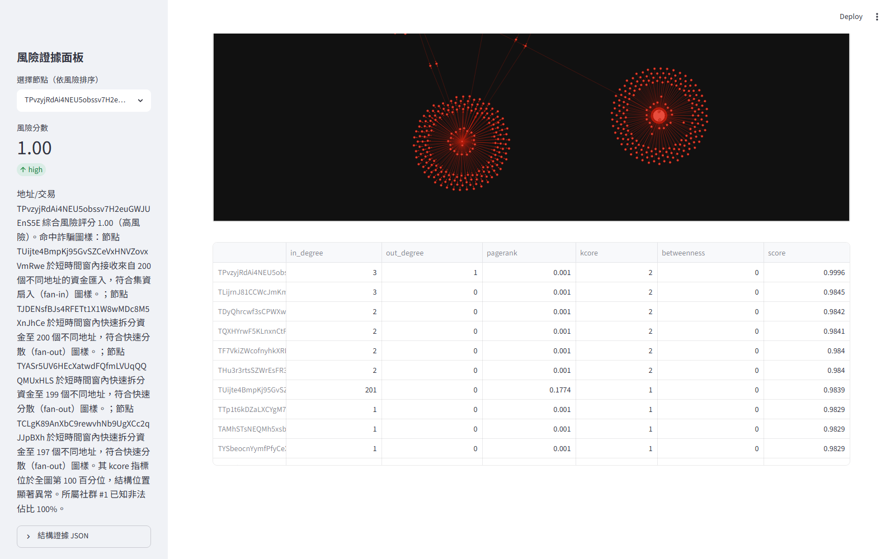

# 鏈鏡 ChainLens

**基於社會網路分析之虛擬資產詐騙金流偵測平台**
（2026 台北金融科技獎—校園組 提案 MVP）

ChainLens 以社會網路分析（SNA）＋圖神經網路（GNN）偵測虛擬資產詐騙金流，服務對象為台灣 VASP 業者的法遵篩查。核心賣點是**可解釋性**：每個風險判定都附帶結構證據——中心性異常、社群歸屬、資金路徑圖樣——而非黑箱分數。

## 系統架構



## 快速開始（5 個指令）

```bash
git clone https://github.com/zuemen/ChainLens.git && cd ChainLens
make setup        # uv sync 安裝依賴（需先安裝 uv：pip install uv）
make test         # pytest 全綠（不依賴大資料集）
make api          # FastAPI 於 http://localhost:8000（/docs 看 OpenAPI）
make app          # Streamlit 工作台（離線可用內建範例圖）
```

## Elliptic 資料集下載（訓練用，選配）

模型訓練基準使用 [Elliptic Data Set](https://www.kaggle.com/datasets/ellipticco/elliptic-data-set)（203k 節點比特幣交易圖，licit/illicit 標註）。資料集需自行從 Kaggle 下載：

1. 申請 Kaggle API token（Account → Create New API Token），放到 `~/.kaggle/kaggle.json`
2. 執行：

```bash
make download-data
# 等同：uv run --with kaggle kaggle datasets download -d ellipticco/elliptic-data-set -p data/raw --unzip
```

3. 確認 `data/raw/` 有三個 CSV：`elliptic_txs_features.csv`、`elliptic_txs_classes.csv`、`elliptic_txs_edgelist.csv`
4. 訓練：`make train`（或 `uv run python -m chainlens.models.train --model sage --use-sna`）

若 `data/raw/` 沒有資料集，`make train` 會自動改用合成小圖冒煙驗證管線（指標不具意義）。

## 模型指標（illicit 類別）

遵守 Elliptic 官方時間切分（train ≤ 34 期 / test ≥ 35 期）避免資料洩漏。

| 模型 | 特徵 | Precision | Recall | F1 | PR-AUC |
|---|---|---|---|---|---|
| GCN | 原始 165 維 | 0.440 | 0.531 | 0.481 | 0.499 |
| GraphSAGE | 原始 165 維 | **0.583** | **0.662** | **0.620** | **0.662** |
| GraphSAGE | 原始 + SNA 特徵（消融） | 0.558 | 0.657 | 0.604 | 0.657 |

> 訓練設定：CPU、200 epochs、hidden 64、lr 0.01、加權 CrossEntropy（逆類別頻率）、weight decay 5e-4；SNA 特徵＝in/out degree、PageRank、k-core、近似 betweenness（64 源點）z-score。

> 消融觀察：串接 SNA 特徵未提升 F1（0.604 vs 0.620）——GNN 的訊息傳遞已隱含學到局部結構。SNA 在本系統的價值在**可解釋層**：風險證據面板以中心性百分位、社群風險佔比與圖樣命中產生人讀得懂的調查敘事（見下方截圖），此為純 GNN 分數無法提供的。

其他可用訓練選項（研究驅動，見 [docs/RESEARCH.md](docs/RESEARCH.md)）：

```bash
uv run python -m chainlens.models.train --model rf          # Random Forest 基線（Weber 2019 最強基線 F1≈0.788）
uv run python -m chainlens.models.train --model sage-rmp    # GraphSAGE + reverse message passing（AAAI 2024 Multi-GNN）
uv run python -m chainlens.models.train --model sage --loss focal   # Focal Loss 處理極度不平衡
```

## 研究基礎與 Roadmap

本專案的設計選擇與改進方向根據對 14 個主流研究方向的深度調查（Elliptic/Elliptic2 基準、
IBM Multi-GNN、時序 GNN、洗錢 typology、異質性 GNN、GNN 可解釋性、LLM+圖、TRON/USDT 實證、
商用系統、聯邦/隱私 AML 等），完整定位、五大領域痛點對應表與 Roadmap 見
**[docs/RESEARCH.md](docs/RESEARCH.md)**；逐項結構化調查結果在 `research/`。

## Demo 截圖

內建範例圖（含集資扇入、快速分散、剝洋蔥鏈三種圖樣）：



真實 TRON 地址 2-hop USDT 金流圖（795 節點，TronGrid 即時抓取）與 SNA 指標表：





## API 範例

```bash
# 離線範例圖（無需網路 / API key）
curl -X POST http://localhost:8000/score \
  -H "Content-Type: application/json" \
  -d '{"address": "TScamCollector001", "mode": "example"}'

# TRON 即時 2-hop 圖（建議設定 TRONGRID_API_KEY，見 .env.example）
curl -X POST http://localhost:8000/score \
  -H "Content-Type: application/json" \
  -d '{"address": "T你的地址", "mode": "tron"}'
```

回應格式：`{target, risk_score, label, evidence[]}`，`evidence` 含 `top_features`、`centrality_percentile`、`community_risk_ratio`、`motif_hits[]` 與中文調查敘事 `narrative_zh`。

## 詐騙圖樣規則

| 圖樣 | 定義 |
|---|---|
| 集資扇入 fan-in | 短時間窗內 ≥N 個來源匯入同一節點 |
| 快速分散 fan-out | 單節點快速拆分至 ≥N 個新地址 |
| 集散 gather-scatter | 同一節點先集資後分散（smurfing/layering 典型結構，含時間順序檢查） |
| 剝洋蔥鏈 peeling chain | 連續 ≥K 跳、每跳保留大額轉出＋小額剝離 |

## 專案結構

```
chainlens/
├── data/        # elliptic.py（CSV→PyG/NetworkX）、tron.py（TronGrid 2-hop 抓取）
├── sna/         # metrics.py、community.py（Louvain）、motifs.py（圖樣規則）
├── models/      # gcn.py、sage.py、train.py（時間切分訓練 + SNA 消融）
├── explain/     # evidence.py（結構證據 + 中文敘事）
├── api/         # main.py（FastAPI /score）
└── app/         # workbench.py（Streamlit + PyVis）
```

## 開發

- 套件管理：[uv](https://docs.astral.sh/uv/)；lint：`make lint`（ruff）；測試：`make test`（pytest，全部使用小型合成圖 fixture）
- 環境變數範本見 `.env.example`；secrets 絕不入版控
- CI：GitHub Actions（ruff + pytest）

## 免責聲明

本專案為學術研究與競賽展示用途，風險分數與調查敘事僅供參考，**不構成投資建議、法律意見或合規判定**。實際法遵決策請諮詢專業人士並遵循主管機關規範。

## License

MIT © ChainLens Team
